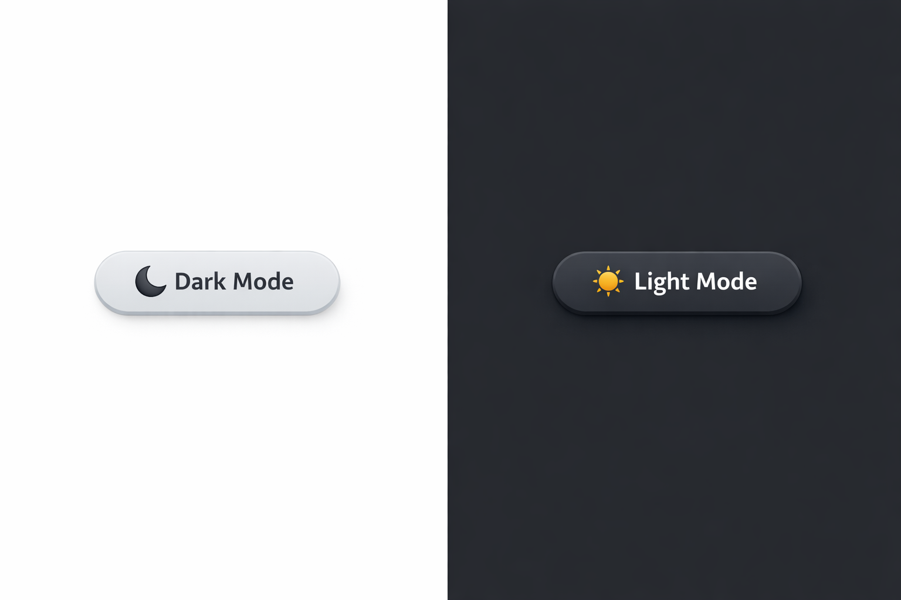

# 🌗 Theme Changer Button (JavaScript)

A simple Light / Dark Theme Changer Button built using HTML, Tailwind CSS, and JavaScript.
The theme switches instantly with smooth animations and icon changes.

#### ✨ Features

- 🌞 Light Mode & 🌙 Dark Mode

- 🎨 Styled using Tailwind CSS

- ⚡ Smooth transition effects

- 🖱️ Click animation

- 🧠 Uses querySelector() (modern JS)

- 📱 Responsive design

##### 📂 Project Structure
theme-changer/
│
├── index.html
├── theme.js
└── README.md

🚀 How It Works

A button toggles the dark class on the <html> element

Tailwind’s dark: utilities change styles automatically

Button text and icon update on each click

#### 🧩 Technologies Used

+ HTML5

+ Tailwind CSS (CDN)

+ JavaScript (Vanilla JS)

####  🖱️ Usage

1. Open index.html in your browser

2. Click the Theme Changer button

3. Switch between Light Mode and Dark Mode

#### 🔘 Button Behavior

Mode	 Button     Text	    Icon
Light	 Dark       Mode	     🌙
Dark	 Light      Mode	     ☀️

#### 📸 Output Preview

- Light mode → white background with gray button

- Dark mode → dark background with dark button

- Smooth hover and click animation

#### ✨ Button Features

✅ Smooth transition
✅ Icon changes (🌙 / ☀️)
✅ Click animation
✅ Tailwind styling
✅ Uses getElementById
✅ Clean & beginner-friendly

#### 🎨 Button Look

- Light mode → Gray button on white background

- Dark mode → Dark button on dark background

- Hover → Slight zoom

- Click → Button presses down

### OUTPUT

📄 License

This project is open-source and free to use for learning and personal projects.